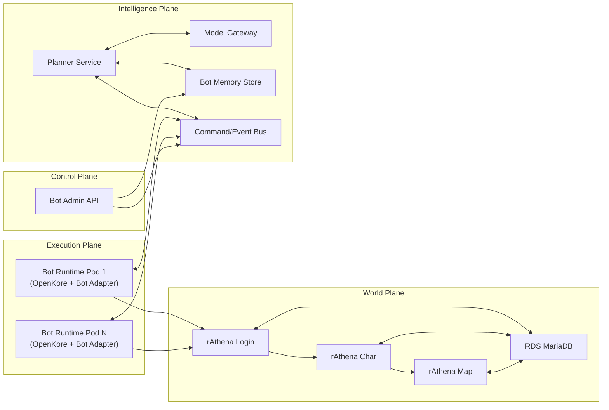

Target Architecture

World plane: keep login, char, and map as separate Kubernetes workloads because that is how rAthena already thinks. Their authoritative database should be RDS MariaDB, not the same store as bot personalities.
Execution plane: each bot gets its own pod, and each pod runs exactly one OpenKore process. I would wrap OpenKore with a thin bot-adapter container so the rest of the platform talks to your API, not directly to OpenKore internals.
Intelligence plane: make the planner stateless. It reads bot state, reads memory, calls the model gateway, and emits high-level commands. It should never own the bot process.
Data plane for bots: use a separate store for bot identity and memory. My recommendation is DynamoDB for structured bot state, S3 for larger memory blobs/transcripts, and a low-latency coordination layer such as Valkey or an event bus for leases, heartbeats, cooldowns, and commands.
Control plane: add a small admin/orchestrator API that declares which bots should exist, what profile they use, and whether they are enabled.

How Things Should Connect

Bot Runtime Pod logs into rAthena exactly like a player.
The bot adapter publishes telemetry and state updates to the command/event layer.
The planner consumes that state, loads the bot’s long-term memory and personality, and asks the model for a high-level decision.
The planner emits a command back onto the bus for that bot_id.
The bot adapter consumes the command and translates it into local OpenKore actions.
Outcomes get written back to bot memory, while the actual game results remain authoritative in rAthena’s world DB.

EKS managed node groups on EC2
RDS MariaDB for the Ragnarok world
StatefulSet for bot runtimes if you want stable named bot pods from day one
DynamoDB for bot personalities, relationships, and compact long-term memory
S3 for larger bot journals, transcripts, and debug snapshots
NLB only if you want external TCP clients to connect to the RO services